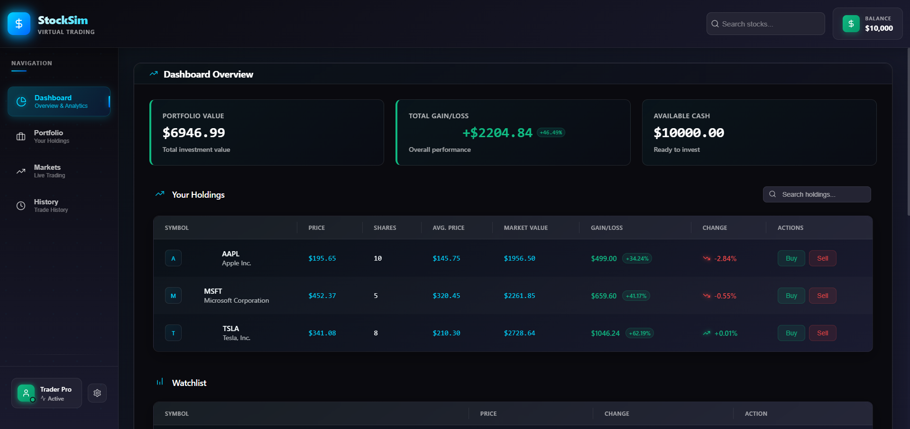

# Stock Simulator

A modern, responsive stock market simulator built with React and Node.js that allows users to practice trading stocks with virtual money.



## Features

- Dashboard with portfolio summary and key metrics
- Real-time stock tracking and market data
- Watchlist for monitoring favorite stocks
- Transaction history and performance analysis
- Responsive design for desktop and mobile

## File Structure

```
stock-simulator/src/
├── components/
│   │   ├── styles/           # styles for components
│   │   ├── Dashboard.jsx      
│   │   ├── Portfolio.jsx      
│   │   ├── Market.jsx         
│   │   ├── History.jsx        
│   │   ├── Header.jsx         
│   │   ├── Sidebar.jsx        
│   │   ├── TradeModal.jsx     
│   │   └── StockSimulator.jsx # main component
│   ├── services/
│   │   └── stockService.js     
│   ├── App.css
│   ├── App.js                 # initilises the stock simulator
│   ├── index.js
│   ├── reportWebVital.js
```

## Useful code snippets
 
```jsx
// Calculate portfolio metrics (include in StockSimulator.jsx)
const portfolioValue = portfolio.reduce((total, stock) => total + (stock.shares * stock.currentPrice), 0);
const totalCost = portfolio.reduce((total, stock) => total + (stock.shares * stock.avgPrice), 0);
const totalGainLoss = portfolioValue - totalCost;
const gainLossPercent = totalCost > 0 ? ((portfolioValue / totalCost - 1) * 100).toFixed(2) : 0;
const availableCash = 10000; // Starting amount - would be tracked in a real app
```

## Prerequisites

Before you begin, ensure you have the following installed:
- [Node.js](https://nodejs.org/) (v14.x or later)
- [npm](https://www.npmjs.com/) (v6.x or later)

## Installation

### Step 1: Clone the repository

```bash
git clone https://github.com/yourusername/stock-simulator.git
cd stock-simulator
```

### Step 2: Install dependencies

```bash
npm install
```

This will install all required dependencies including:
- React
- React DOM
- Lucide React (for icons)
- Axios (for API requests)

### Step 3: Configure environment variables

Create a `.env` file in the root directory and add any necessary API keys:

```
REACT_APP_API_KEY=your_stock_api_key_here
```

*Note: You'll need to obtain API keys from your preferred stock data provider (Alpha Vantage, IEX Cloud, etc.).*

## Running the Application

### Development mode

```bash
npm start
```

This will start the development server. Open [http://localhost:3000](http://localhost:3000) to view the application in your browser.

### Production build

```bash
npm run build
```

This creates an optimized production build in the `build` folder.

## Troubleshooting Common Issues

### "Cannot find module 'lucide-react'"

If you get this error, make sure you've installed the Lucide React package:

```bash
npm install lucide-react
```

## Setting Up the Backend (Optional)

For a complete experience with user accounts and saved portfolios:

### Step 1: Create a server directory

```bash
mkdir server
cd server
npm init -y
```

### Step 2: Install server dependencies

```bash
npm install express cors mongoose dotenv
```

### Step 3: Create the server file

Create a `server.js` file in the server directory with your backend logic.

### Step 4: Run the server

```bash
node server.js
```

## Connecting to Stock Market APIs

This application is designed to work with various stock market data providers. To use real market data:

1. Register for an API key with one of the following services:
   - [Alpha Vantage](https://www.alphavantage.co/)
   - [IEX Cloud](https://iexcloud.io/)
   - [Finnhub](https://finnhub.io/)
   - [Polygon.io](https://polygon.io/)

2. Add your API key to the `.env` file.

3. Update the API service files to use your chosen provider.

## Contributing

Contributions are welcome! Please feel free to submit a Pull Request.

## Acknowledgments

- Icons provided by [Lucide React](https://lucide.dev/)
- UI styling with [Tailwind CSS](https://tailwindcss.com/)